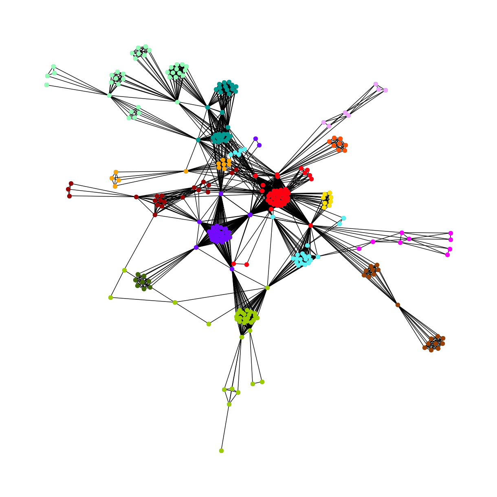

# Final Project for BIF498HH - Network Science 

The following directories are included in this repository:

* [`benchmark/`](./benchmark/) : contains the benchmarking datasets of networks used in the project
* [`code/`](./code/) : contains the code used in the project
  * [`methods.ipynb`](./code/methods.ipynb) : contains the functions and methods used for attack and saving resulting metrics, statistics, time taken and graph objects. To use results from this file all of the data was saved in the `results/` directory.
  * [`analysis_and_plotting.ipynb`](./code/analysis_and_plotting.ipynb) : contains the code used to analyse and plot the results (already saved)
  * [`plci_benchmark.r`](./code/plci_benchmark.r) : contains the code taken from [here](https://github.com/drguilbe/complexpaths) to calculate the complex centrality (plci) of each node and edited to loop over all the graphs in the benchmarking datasets and save the results in a csv file
* [`figures/`](./figures/) : contains the figures used in the report
  * [`edges/`](./figures/edges/) : contains the figures in the edge attack section of the results
  * [`nodes_community/`](./figures/nodes_community/) : contains the figures in the node community attack section of the results
  * [`nodes_vanilla/`](./figures/nodes_vanilla/) : contains the figures in the node attack section of the results
* [`graphs/`](./graphs/) : contains the graphs generated in this project at 10 instances of the attack
* [`plci_results/`](./plci_results/) : contains the results of the plci values for each node in each graph in the benchmarking datasets (each graph has a csv file)
* [`processed_results/`](./processed_results/) : contains the processing of results already saved into ranks in csv files 
* [`results/`](./results/) : contains the results of the attacks on the benchmarking datasets, mainly constituting of
  * 7 csv files for each type of attack (node, community, edge) that include:
    * the time taken for each attack on each network
    * the R metric value of each attack on each network
    * the InterE value of each attack on each network
    * the sequence of LCC sizes for each attack on each network per batchs of 1% (sequence of 100)
    * the sequence of LCC sizes for each attack on each network per one node removed
    * the sequence of Global Efficiency for each attack on each network per batchs of 1% (sequence of 100)
    * the sequence of Global Efficiency for each attack on each network per one node removed
  * [`stats.csv`](./results/stats.csv) : that have initial statistics of each graph generated in the code containing number of nodes, edges, density, average degree, average clustering coefficient, average shortest path length and diameter

This repository is licensed under the MIT License. See the LICENSE file for more details.